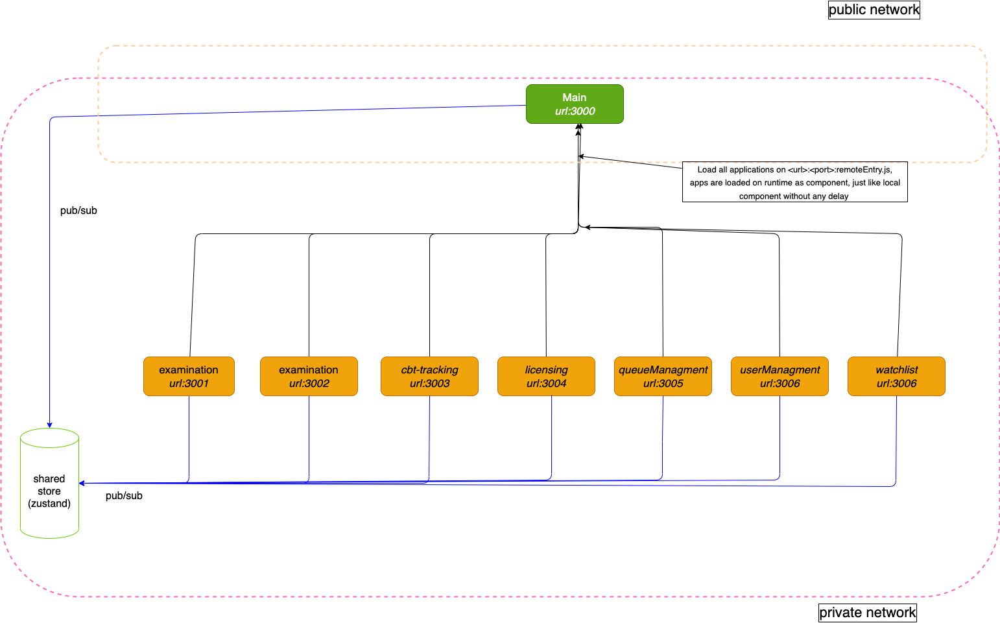

# mfe-react-webpack-module-federation
An experimental way of making loosely coupled microferontends, giving freedom to teams on developing solely, giving freedon in terms of deployment and avoiding single point failure on learge frontend applications. 

# starting the application

1. install deps
  ```bash
    pnpm i
  ```
2. run in dev mode
```bash
 pnpm dev
```
3. prod [not yet ready]


# Application stracture

```bash
.
├── apps
│   ├── auto-ecole
│   ├── cbt-tracking
│   ├── examination
│   ├── licensing
│   ├── main # app shell, loads all of other applications
│   ├── queue-managment
│   ├── template
│   ├── user-managment
│   └── watchlist
├── package.json
├── packages
│   ├── eslint-config-custom
│   ├── shared-util
│   ├── tailwind-config
│   ├── tsconfig
│   ├── store #to be added
│   └── webpack-config
├── pnpm-lock.yaml
├── pnpm-workspace.yaml
└── turbo.json
```

# Diagram

